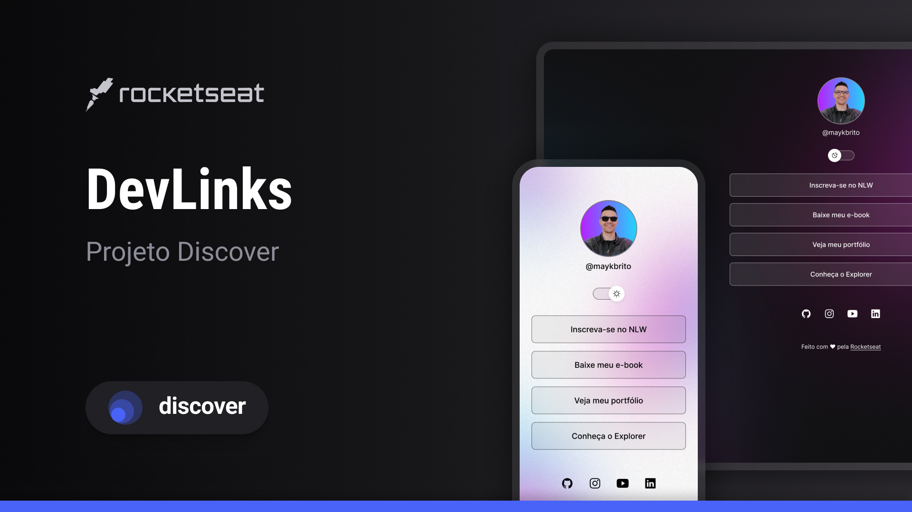

<h1 align="center"> DevLinks </h1>

  <a href="#-tecnologias">Tecnologias</a>&nbsp;&nbsp;&nbsp;|&nbsp;&nbsp;&nbsp;
  <a href="#-projeto">Projeto</a>&nbsp;&nbsp;&nbsp;|&nbsp;&nbsp;&nbsp;
  <a href="#-layout">Layout</a>&nbsp;&nbsp;&nbsp;|&nbsp;&nbsp;&nbsp;
  <a href="#memo-licença">Licença</a>

 

  

 

  

## 🚀 Tecnologias

Esse projeto foi desenvolvido com as seguintes tecnologias:

- HTML
- CSS
- JavaScript
- Git & GitHub
- Figma

Bibliotecas

- [Google Fonts](https://fonts.google.com/)

Utilitários

- [Ionicons](https://ionic.io/ionicons)

## 💻 Projeto

DevLinks é um agregador de links para usar como cartão de visitas online.

## 🔖 Layout

Você pode visualizar o layout do projeto através [desse link](https://www.figma.com/file/KSX8g06V06sDVmKc9fpLsW/DevLinks-%E2%80%A2-Projeto-Discover-(Community)?type=design&t=0THOhDKnwleTPEcV-6). É necessário ter conta no [Figma](https://figma.com) para acessá-lo.

## 📝 Licença

Esse projeto está sob a licença MIT. Veja o arquivo [LICENSE](.github/LICENSE.md) para mais detalhes.

---

Feito com ♥ por [pedrothecatholic](https://github.com/pedrothecatholic) :wave:

<!--START_SECTION:footer-->

 
 
<!-- 

  

 -->

<!--END_SECTION:footer-->